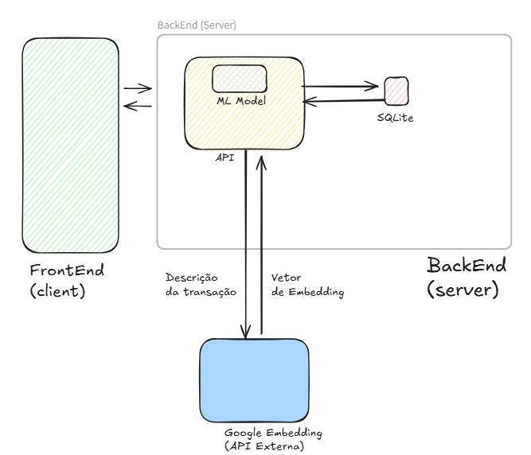

# Embedding Microservice

**Embedding Generation API** powered by Google Gemini

A specialized microservice that generates semantic embeddings for financial transaction descriptions using Google's Gemini embedding model. Part of a personal finance management system.



Other repositories:
* https://github.com/GuilhermePFM/mvp-front-end
* https://github.com/GuilhermePFM/mvp-api
---

## Overview

This microservice transforms transaction descriptions into 768-dimensional embedding vectors using Google's Gemini API. These embeddings enable machine learning models to classify and categorize financial transactions based on semantic similarity.

**Key Capabilities:**
- Batch embedding generation for multiple transaction descriptions
- Unit-normalized embeddings 
- RESTful API with OpenAPI documentation
- Integration with Gemini's classification-optimized embedding model

**Technology Stack:**
- Python 3.x
- Flask with OpenAPI 3 support
- Google Gemini API (`models/gemini-embedding-001`)
- Pydantic for request/response validation
- NumPy for vector normalization

---

## Architecture

### Component Structure

```
mvp-embedding/
├── app.py                          # Flask application entry point
├── config.py                       # App configuration and OpenAPI setup
├── apis/
│   └── embedding.py                # POST /embedding endpoint implementation
├── machine_learning/
│   └── embedding.py                # Vector normalization utilities
├── schemas/
│   └── embedding_schema.py         # Pydantic validation schemas
└── test/
    └── test_embedding_api.py       # Unit and integration tests
```

### Request Flow

```
Client Request
    ↓
POST /embedding
    ↓
[apis/embedding.py]
    ↓
Validate input (Pydantic) → EmbeddingListSchema
    ↓
For each description:
    ↓
    Call Gemini API
        - Model: gemini-embedding-001
        - Task Type: CLASSIFICATION
        - Dimensionality: 768
    ↓
    Normalize embedding vector
        [machine_learning/embedding.py]
        - Convert to unit length (L2 norm = 1)
    ↓
    Collect normalized embeddings
    ↓
Return EmbeddingResponseSchema
```

### Key Design Decisions

- **768-Dimensional Embeddings**: Google's recommended dimensionality for optimal performance with Gemini models
- **Unit Normalization**: All embeddings normalized to unit length, enabling efficient cosine similarity calculations
- **Batch Processing**: Single request can process multiple transaction descriptions
- **Task Type: CLASSIFICATION**: Embedding model optimized for categorization tasks
- **Synchronous Processing**: Simple request-response pattern for reliability

---

## Microservices Integration

This service is part of a 3-microservice architecture for personal finance management:

1. **Frontend/Interface** - User interface for transaction management
2. **General Backend** - Core business logic, data persistence, ML classification
3. **Embedding API** (this service) - Embedding generation

### Integration Pattern

The General Backend consumes this API to generate embeddings for uploaded transactions. The embeddings are then used by ML classification models to automatically categorize spending.

**API Contract:**

```
POST /embedding
Content-Type: application/json

Request:
{
  "descriptions": [
    {"description": "Compra de alimentos no supermercado"},
    {"description": "Pagamento de conta de luz"}
  ]
}

Response (200):
{
  "embeddings": [
    [0.023, -0.145, 0.089, ...],  // 768-dimensional vector
    [0.112, 0.034, -0.201, ...]   // 768-dimensional vector
  ]
}

Response (400):
{
  "message": "Error creating embedding for transaction '...': [details]"
}
```

---

## Prerequisites & Installation

### Requirements

- Python 3.8+
- Google Gemini API key ([Get one here](https://ai.google.dev/))
- pip or similar package manager

### Installation

1. Clone the repository:
```bash
git clone <repository-url>
cd mvp-embedding
```

2. Create and activate a virtual environment:
```bash
python -m venv venv
source venv/bin/activate  # On Windows: venv\Scripts\activate
```

3. Install dependencies:
```bash
pip install -r requirements.txt
```

4. Configure environment variables:
```bash
cp env.example .env
# Edit .env and add your GEMINI_API_KEY
```
**A API key was provided in the MVP delivery notes as instructed.**

---

## Configuration

### Environment Variables

Create a `.env` file in the project root:

| Variable | Required | Default | Description |
|----------|----------|---------|-------------|
| `GEMINI_API_KEY` | **Yes** | - | Your Google Gemini API key |
| `GEMINI_MODEL` | No | `models/gemini-embedding-001` | Gemini embedding model to use |
| `MODEL_PATH` | No | - | Custom path for ML models (currently unused) |

**Example `.env`:**
```env
GEMINI_API_KEY=AIzaSy...your_key_here
GEMINI_MODEL=models/gemini-embedding-001
```

### Configuration Details

The service uses the Gemini API with these parameters:
- **Output Dimensionality**: 768 (hardcoded, Google's recommendation)
- **Task Type**: CLASSIFICATION (optimized for transaction categorization)
- **Endpoint**: `https://generativelanguage.googleapis.com/v1beta/{model}:embedContent`

---

## Usage

### Starting the Development Server

```bash
python app.py
```

The server starts on `http://localhost:5000` by default.

### API Endpoints

#### `GET /`
Redirects to `/openapi` for interactive API documentation.

#### `POST /embedding`
Generates embeddings for transaction descriptions.

**Request Example (cURL):**
```bash
curl -X POST http://localhost:5000/embedding \
  -H "Content-Type: application/json" \
  -d '{
    "descriptions": [
      {"description": "Compra de alimentos"},
      {"description": "Pagamento de conta de luz"}
    ]
  }'
```

**Request Example (Python):**
```python
import requests

response = requests.post(
    "http://localhost:5000/embedding",
    json={
        "descriptions": [
            {"description": "Compra de alimentos"},
            {"description": "Pagamento de conta de luz"}
        ]
    }
)

embeddings = response.json()["embeddings"]
print(f"Generated {len(embeddings)} embeddings")
print(f"Dimension: {len(embeddings[0])}")
```

**Response:**
```json
{
  "embeddings": [
    [0.0234, -0.1456, 0.0892, ...],  // 768 floats
    [0.1123, 0.0341, -0.2015, ...]   // 768 floats
  ]
}
```

### OpenAPI Documentation

Access interactive API documentation at:
- Swagger UI: `http://localhost:5000/openapi`
- Alternative styles available through the OpenAPI interface

---

## Testing

### Running Tests

```bash
# Run all tests
pytest

# Run with verbose output
pytest -v

# Run specific test file
pytest test/test_embedding_api.py

# Run with coverage
pytest --cov=apis --cov=machine_learning
```

### Test Coverage

The test suite includes:

1. **Unit Tests**: Mock Gemini API responses to test normalization and error handling
2. **Integration Tests**: Real API calls to validate end-to-end functionality (requires valid API key)

**Key Tests:**
- `test_embedding_api_returns_normalized_vectors`: Validates normalization logic
- `test_embedding_api_handles_external_failure`: Tests error handling
- `test_integration`: End-to-end test with actual Gemini API

**Note**: The integration test (`test_integration`) requires a valid `GEMINI_API_KEY` in your environment.

---

## Deployment

### Production Considerations

**WSGI Server**: Use a production WSGI server instead of Flask's development server:

```bash
# Install gunicorn
pip install gunicorn

# Run with gunicorn
gunicorn -w 4 -b 0.0.0.0:5000 app:app
```

**Recommended Configuration:**
- Workers: 2-4 per CPU core
- Timeout: 60s (Gemini API can be slow)
- Logging: Configure structured logging for production

### Environment Variables in Production

Use secure secret management:
- **AWS**: Secrets Manager or Parameter Store
- **GCP**: Secret Manager
- **Azure**: Key Vault
- **Kubernetes**: Sealed Secrets or external-secrets

### Docker Deployment

Currently, no Dockerfile exists. Suggested `Dockerfile`:

```dockerfile
FROM python:3.11-slim

WORKDIR /app

COPY requirements.txt .
RUN pip install --no-cache-dir -r requirements.txt

COPY . .

EXPOSE 5000

CMD ["gunicorn", "-w", "4", "-b", "0.0.0.0:5000", "--timeout", "60", "app:app"]
```

**Build and run:**
```bash
docker build -t embedding-api .
docker run -p 5000:5000 --env-file .env embedding-api
```

### Scaling Considerations

- **Rate Limits**: Gemini API has rate limits; implement request queuing for high throughput

---

## Technical Notes

### Embedding Properties

- **Dimensionality**: 768 (Google's recommended dimension for gemini-embedding-001)
- **Normalization**: All embeddings are L2-normalized to unit length (||v|| = 1.0)
- **Task Type**: CLASSIFICATION (optimized for categorization vs. retrieval or similarity)
- **Output Range**: After normalization, each component is in [-1, 1], with vector norm = 1


### Error Handling

- **Network Errors**: Returns HTTP 400 with error details
- **Invalid API Key**: Caught and logged with descriptive message
- **Malformed Requests**: Pydantic validation ensures schema compliance
- **Logging**: All errors logged with transaction description context

---

## API Reference

### Schemas

**EmbeddingSchema:**
```python
{
  "description": str  # Transaction description text
}
```

**EmbeddingListSchema:**
```python
{
  "descriptions": List[EmbeddingSchema]  # Array of descriptions
}
```

**EmbeddingResponseSchema:**
```python
{
  "embeddings": List[List[float]]  # Array of 768-dimensional vectors
}
```

**ErrorSchema:**
```python
{
  "message": str  # Error description
}
```